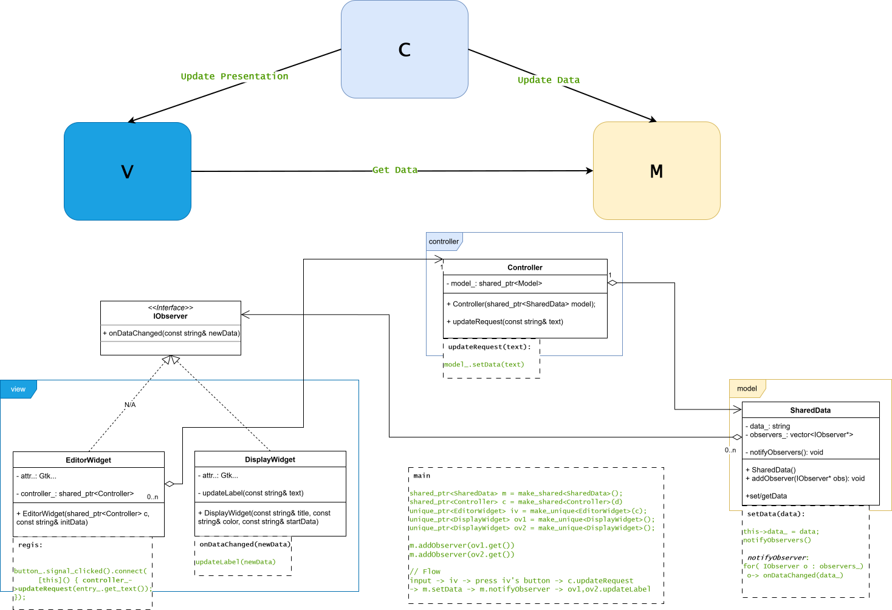

## Architecture Patterns
### 1. MVVM
- **MVVM (Model - View - ViewModel)** is an architecture pattern that separates the user interface (`View`) from the business logic and data (`Model`) through an intermediary component called the `ViewModel`
- **Components:**
    - **Model**: responsible for managing and abstracting data sources (databases, APIs, ..). 
    `Model` and `ViewModel` work together to get and save the data.
    - **View**: displays data provided by the `ViewModel` and informs the `ViewModel` about user actions. This layer observes the `ViewModel` and does not contain application logic.
    - **ViewModel**: exposes data and state that are relevant to the `View`, and transforms data from Model into a suitable format. Moreover, it serves as a link between the `Model` and the `View`.
    - **Binder** (Data Binding): connects the View and the ViewModel, automatically synchronizing data between them. This mechanism allows the View to update when the `ViewModel` changes, and vice versa.

- **Workflow:**
    1. User interacts with the `View` (e.g., clicks a button).
    2. The `View` notifies the `ViewModel`.
    3. The `ViewModel` processes the input, applies logic, and may request data from the `Model`.
    4. The `Model` fetches or updates the data (e.g., from an API or database).
    5. The `Model` sends data back to the `ViewModel`.
    6. The `ViewModel` updates the observable data, which automatically updates the `View` through `data binding or observers`.
```bash
User
 ↓
View ↔ ViewModel ↔ Model    # view automatically update
       (data binding)
```
### 2. MVC

- **MVC (Model - View - Controller)** is an architectural pattern that separates the user interface (`View`) from the application logic and data (`Model`) using an intermediary component called the `Controller`.
- **Components:**
    - **Model**: is responsible for managing and abstracting data sources (databases, APIs, etc.). The `Model` handles data retrieval, storage, and business logic.
    - **View**: displays the data provided by the `Model` and represents the user interface. The `View` is responsible only for presentation and `does not contain business logic`.
    - **Controller**: acts as an intermediary between the `View` and the `Model`. It receives user input from the `View`, processes it, and interacts with the `Model` to update or retrieve data. The `Controller` then determines which `View` should display the result.

- **Workflow:**
    1. User interacts with the `View` (e.g., clicks a button).
    2. The `View` sends the user input to the `Controller`.
    3. The `Controller` processes the input, performs business logic, and may update the `Model`.
    4. The `Model` updates its data (e.g., saves to a database or gets data from an API).
    5. The `Controller` then updates the `View` based on the new `Model` data.
```bash
User
 ↓
View → Controller → Model
            ↓
           View # view update manually
```
### 3. GTK4
- [Refer](https://docs.gtk.org/gtk4/getting_started.html)

### 4. Examples
### 4.1. simple_ap
- Cos:
    - Quick, Simple
- Pos:
    - Dependency: e.g. what happen when we delete  Gtk::Label m_labelMonitorA;
    - Scalability: 
    - Reusability:

### 4.2. mvc_ap