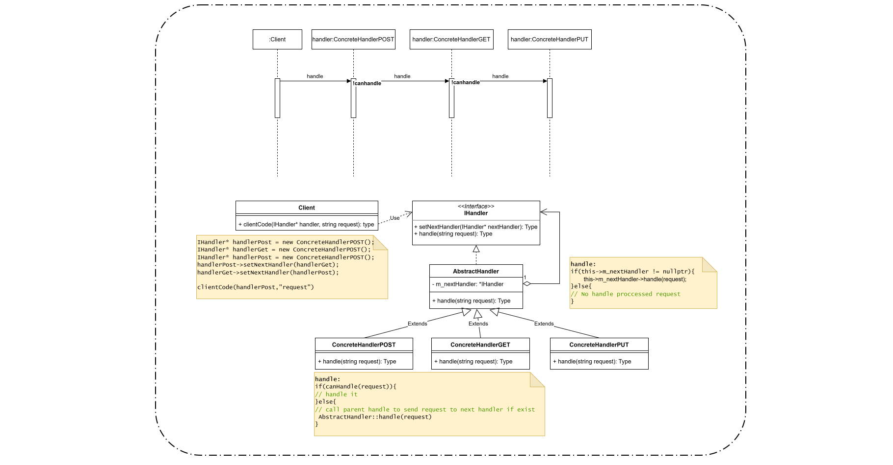
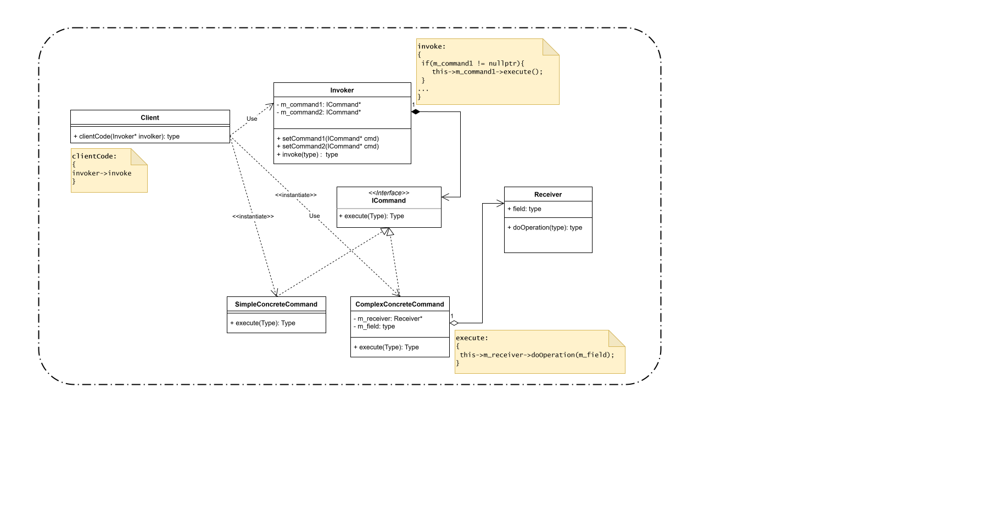
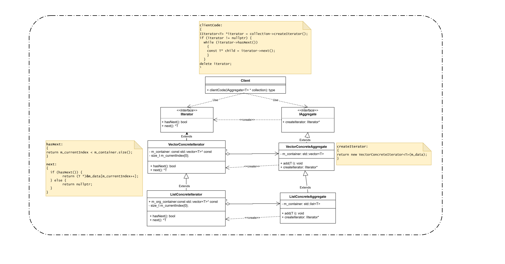
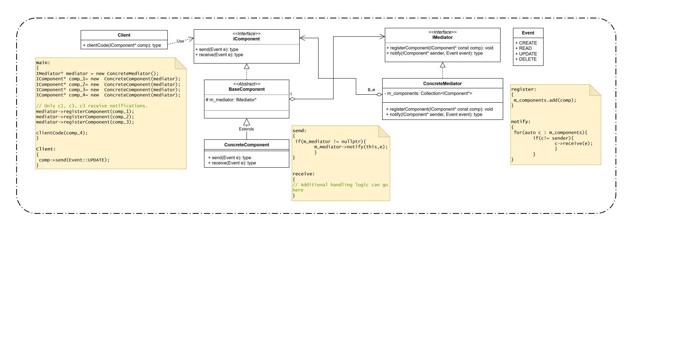
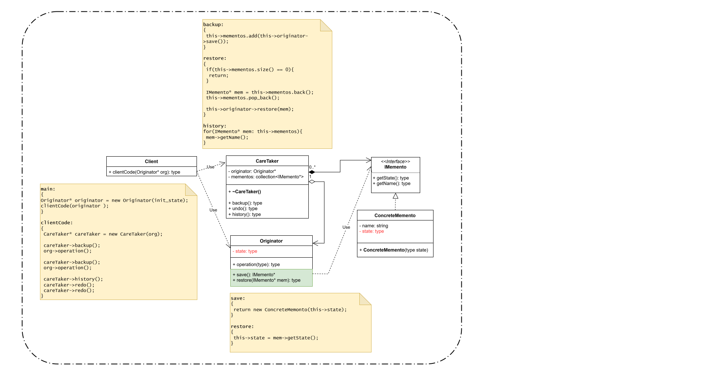
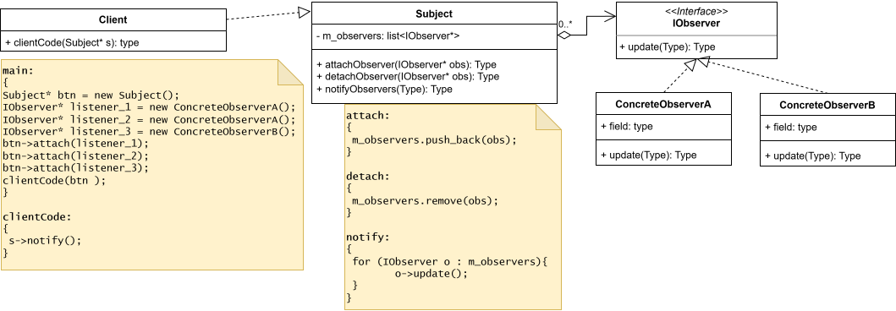
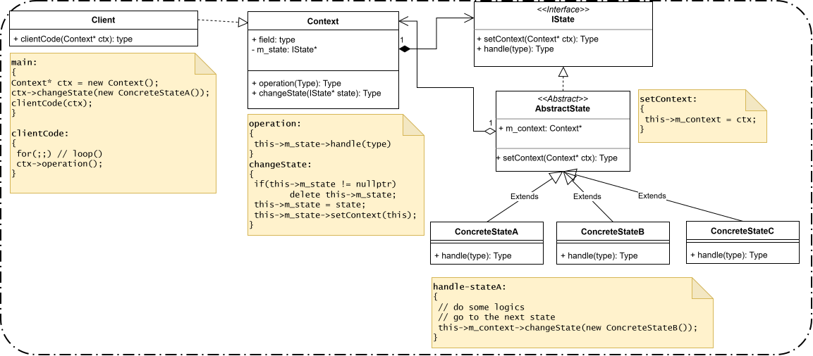
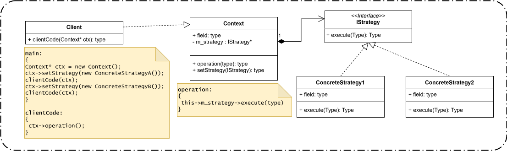
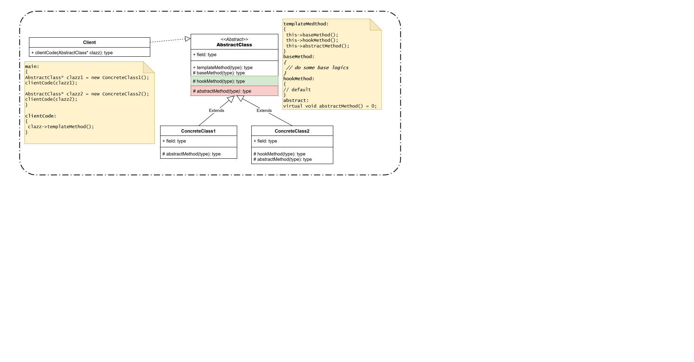
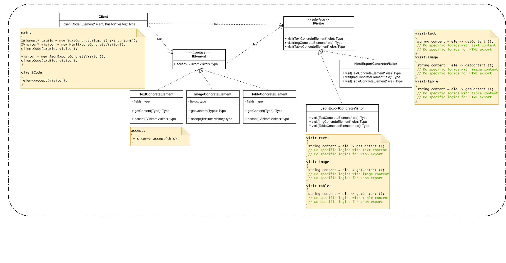

# Behavioral Design Patterns

Behavioral design patterns are concerned with algorithms and the assignment of responsibilities between objects.

---

## 1. Chain of Responsibility

**Chain of Responsibility**  
Lets you pass requests along a chain of handlers. Upon receiving a request, each handler decides either to process the request or to pass it to the next handler in the chain.

**Real-time example:**  
Customer support tickets in a company. Simple requests go to the first-level support, more complex issues go to specialists, and only very complex issues reach managers.

---

## 2. Command

**Command**  
Turns a request into a stand-alone object that contains all information about the request. This lets you pass requests as arguments, delay or queue execution, and support undo operations.

**Real-time example:**  
Using a remote control for smart home devices. Each button press represents a command: turn on lights, open curtains, or play music. You can even undo the last command.

---

## 3. Iterator

**Iterator**  
Lets you traverse elements of a collection without exposing its underlying representation (list, stack, tree, etc.).

**Real-time example:**  
Browsing a photo gallery app. You can swipe left or right to view photos without knowing how the photos are stored internally.

---

## 4. Mediator

**Mediator**  
Reduces chaotic dependencies between objects by forcing them to communicate through a mediator.

**Real-time example:**  
An air traffic control tower. Planes don’t communicate directly with each other; the tower coordinates landings and takeoffs.

---

## 5. Memento

**Memento**  
Lets you save and restore the previous state of an object without revealing its implementation details.

**Real-time example:**  
The “Undo” feature in a text editor. You can revert to a previous version of your document without knowing the details of how the editor stores text internally.

---

## 6. Observer

**Observer**  
Defines a subscription mechanism to notify multiple objects about events happening to the object they’re observing.

**Real-time example:**  
Social media notifications. When someone posts a new photo, all their followers are notified immediately.

---

## 7. State

**State**  
Lets an object alter its behavior when its internal state changes, making it appear as if the object changed its class.

**Real-time example:**  
A traffic light. Its behavior (red, yellow, green) changes automatically depending on its current state.

---

## 8. Strategy

**Strategy**  
Defines a family of algorithms, puts each into a separate class, and makes them interchangeable.

**Real-time example:**  
A navigation app lets you choose between driving, walking, or cycling routes. Each strategy calculates a different route but uses the same interface.

---

## 9. Template Method

**Template Method**  
Defines the skeleton of an algorithm in the superclass but lets subclasses override specific steps without changing its structure.

**Real-time example:**  
Making coffee or tea in a café. The steps (boil water, pour, serve) are the same, but each drink has slightly different preparation steps.

---

## 10. Visitor

**Visitor**  
Lets you separate algorithms from the objects on which they operate.

**Real-time example:**  
A tax calculator that processes different types of items (books, electronics, groceries) without changing the item classes. The calculator “visits” each item to compute tax.
