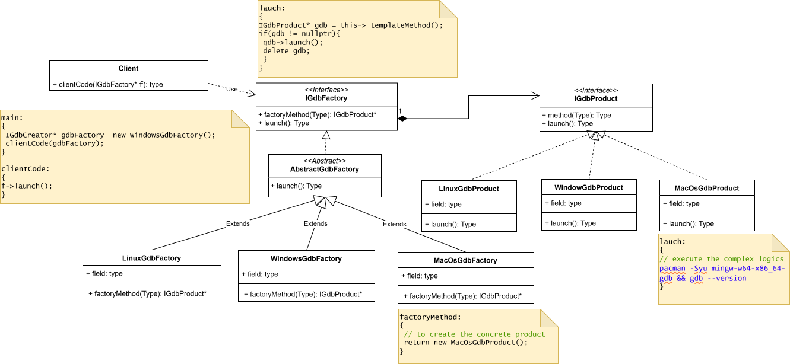
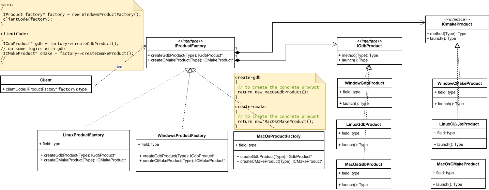
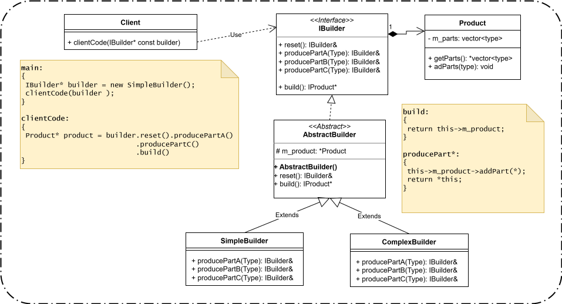
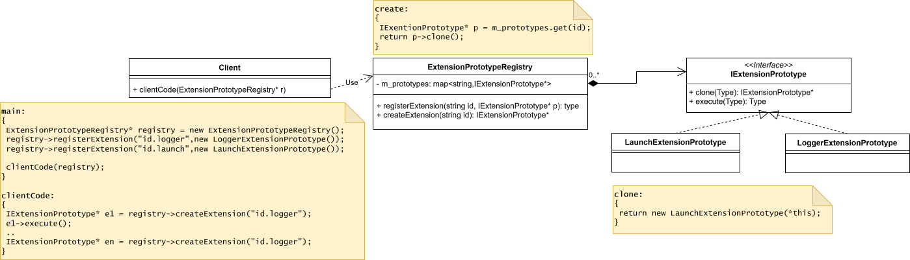
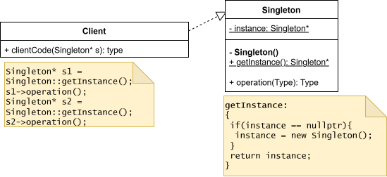

# Creational Design Patterns

Creational design patterns provide various object creation mechanisms, which increase flexibility and reuse of existing code.

---

## 1. Factory Method

**Factory Method**  
Provides an interface for creating objects in a superclass, but allows subclasses to alter the type of objects that will be created.

**Real-time example:**  
A ride-hailing app can create different types of rides: economy, premium, or SUV. The app defines a general interface for booking a ride, and the specific ride type is decided at runtime.

---

## 2. Abstract Factory

**Abstract Factory**  
Lets you produce families of related objects without specifying their concrete classes.

**Real-time example:**  
A furniture store app that sells sets of furniture. If a customer chooses a "Modern" style, the app provides a matching chair, table, and sofa. If "Victorian" style is chosen, it provides a different matching set. The app doesn’t need to know the concrete classes of each furniture piece.

---

## 3. Builder

**Builder**  
Lets you construct complex objects step by step. The pattern allows you to produce different types and representations of an object using the same construction code.

**Real-time example:**  
Ordering a custom pizza online. You can choose the dough, sauce, toppings, and size step by step, resulting in different pizzas, all using the same ordering process.

---

## 4. Prototype

**Prototype**  
Lets you copy existing objects without making your code dependent on their classes.

**Real-time example:**  
Copying a template for a new document in Google Docs. Instead of creating a document from scratch, you duplicate an existing one and modify it.

---

## 5. Singleton

**Singleton**  
Lets you ensure that a class has only one instance, while providing a global access point to this instance.

**Real-time example:**  
A system configuration manager in an app. All parts of the app access the same configuration instance, so settings are consistent across the application.
